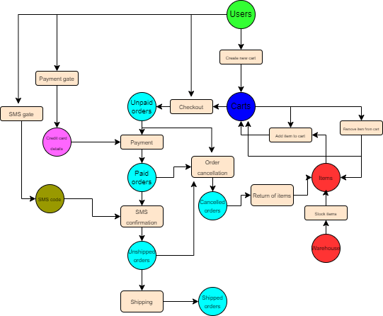

The high-level idea is to associate each user with a cart that will contain the items sold by the store. This cart is then converted to an order, which the user has to interact with multiple times: fill in the address during the checkout step, provide the payment information during the payment step and finally provide the SMS verification code during the SMS confirmation step. 

The data type of the cart can be thought of as a list, where each index corresponds to some particular item being sold, and the value at that index correspons to the amount of that item in the cart. The "Items" cell represents all items in stock, so if an item is put into a card, it is "reserved", so others shoppers can not buy it anymore. The cart is also associated with the user's ID.

The arcs in the network have an implicit weight of 1. The exception is the "Return of items" transition that has an arbitrarily higher weight to allow the returning of multiple items from a cancelled order.

There probably should be some kind of a "time-out" mechanism to release items reserved in a cart for too long, but I am not sure how to model that using Petri nets. But it probably could fall into the "Order cancellation" transition.